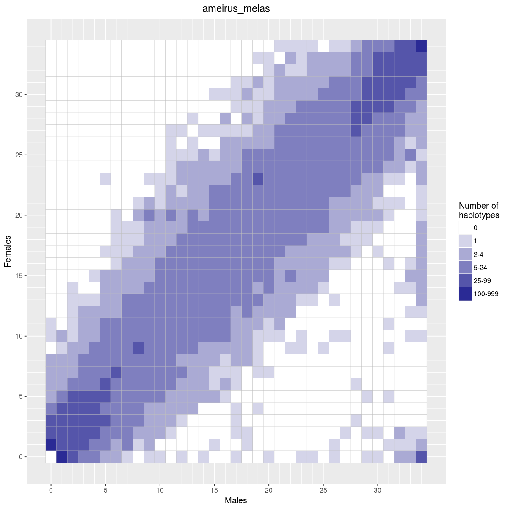
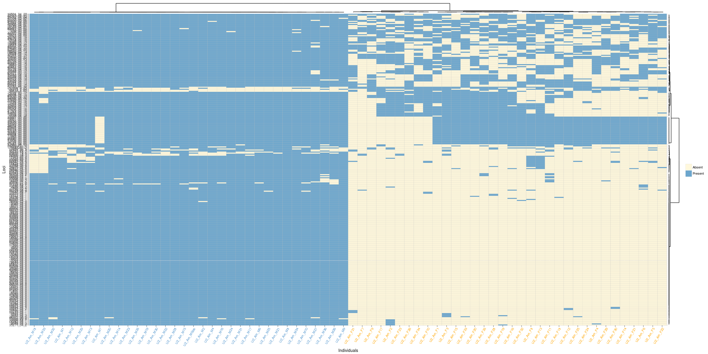
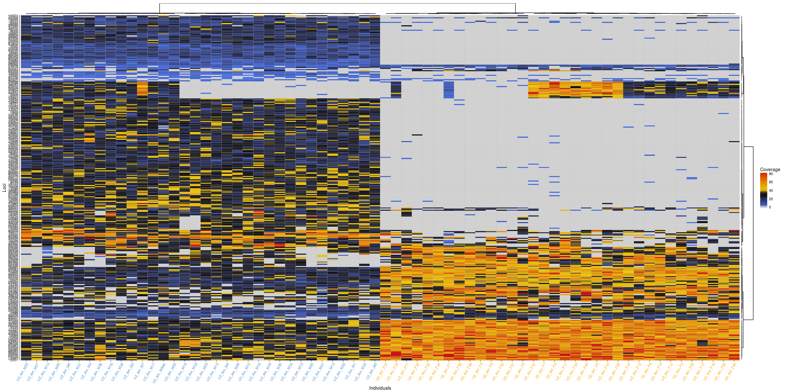
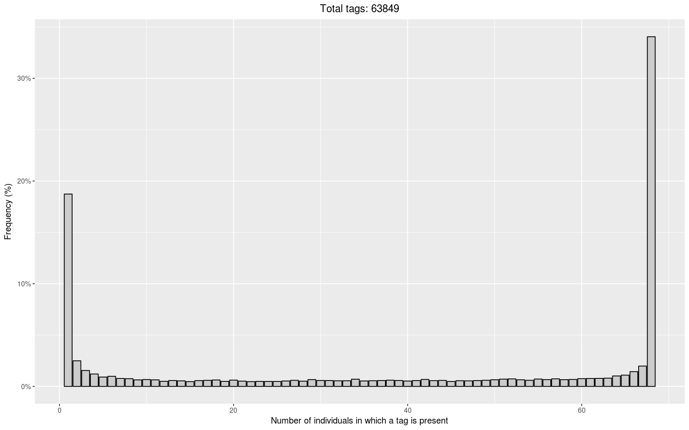

## RADSeq_analysis

### Overview

This software is part of the RADSex pipeline, a method to detect sex-linked sequences in RADSeq data. As such, it is only designed to work with the output of Stacks using specific parameter values. This pipeline was developed for the PhyloSex project, which investigates sex determining factors in a wide range of fish species.

### Requirements

- Python 3.5 or higher
- *Optional (for visualization)* : R 3.3 or higher with the following packages:
    + readr
    + ggplot2
    + reshape2
    + ggdendro
    + grid
    + gtable
    + base
    + svglite
    + scales

- *Optional* : package `progress` to display progress bars in lengthy steps

### Installation

- Clone: `git clone git@github.com:INRA-LPGP/radseq_analysis.git`
- Download the archive and unzip it
- *Optional* : install recommended python packages with `pip3 install -r requirements.txt`
- *Optional* : install R packages for visualization with `Rscript install_packages.R`

### Usage

#### General

`python3 radseq_analysis.py <command> [options]`

**Available commands** :

Command       | Description
------------- | ------------
`heatmap`     | Generates a matrix of haplotypes sex distribution
`haplotypes`  | Extract haplotypes present in a given number of males and females
`frequencies` | Calculate haplotypes frequencies distribution in the population
`rescue`      | Find all alleles in sex-linked loci from the Stacks catalog
`visualize`   | Visualize analyses results using R

 

#### Heatmap

`python3 radseq_analysis.py heatmap -i input_folder -m popmap [-o output_file]`

*Generates a matrix of dimension (Number of males) x (Number of females). The value at coordinates **(i, j)** corresponds to the number of haplotypes found in precisely **i** males and **j** females.*

**Options** :

Option | Full name | Description
--- | --- | ---
`-i` | `--input-folder` | Path to a folder containing the output of denovo_map |
`-m` | `--popmap` | Path to a population map file |
`-o` | `--output-file` | Path to the output file (default: *haplotypes_matrix.tsv*)

 

#### Haplotypes

`python3 radseq_analysis.py haplotypes -i input_folder -m popmap -p positions_list [-o output_file]`

*Extracts all the haplotypes found in a given number of males and females (a position in the haplotypes matrix). The output is a tabulated file with the following fields :*

- *Locus* : catalog ID of the haplotype
- *Males* : number of males in which the haplotype was found
- *Females* : number of females in which the haplotype was found
- *Sequence* : haplotype sequence
- *Male_outliers* : ID of the males in which the haplotype was not found
- *Female_outliers* : ID of the males in which the haplotype was not found

**Options** :

Option | Full name | Description
--- | --- | ---
`-i` | `--input-folder` | Path to a folder containing the output of denovo_map |
`-m` | `--popmap` | Path to a population map file |
`-p` | `--positions` | Path to a file containing the list of positions to extract |
`-o` | `--output-file` | Path to the output file (default: *extracted_haplotypes.tsv*)

 

#### Frequencies

`python3 radseq_analysis.py frequencies -i input_folder [-o output_file]`

*Computes the distribution of haplotypes frequencies in the population. The output is a tabulated file with the following fields*

- *Frequency* : number of individuals in which a haplotype is found
- *Count* : number of haplotypes with the associated frequency in the population

**Options** :

Option | Full name | Description
--- | --- | ---
`-i` | `--input-folder` | Path to a folder containing the output of denovo_map |
`-o` | `--output-file` | Path to the output file (default: *haplotypes_frequencies.tsv*)

 

#### Rescue

`python3 radseq_analysis.py rescue -i input_folder -s sequences_file [-c coverage_file -o output_file]`

*Find all alleles in sex-linked loci from the Stacks catalog by blasting sex-linked sequences and filtering by similarity. If a coverage file is provided, loci coverage will be corrected based on global coverage differences between individuals. The output is a tabulated file with the following fields :*

- Stack_ID: catalog ID of the sex-linked haplotype
- Haplotype_ID: catalog ID of the rescued haplotype (other allele)
- Sequence: rescued haplotype sequence
- Matches: number of matching bases between the sex-linked haplotype and the rescued haplotype
- Mismatches: number of non-matching bases between the sex-linked haplotype and the rescued haplotype
- Gaps: number of gaps between the sex-linked haplotype and the rescued haplotype

**Options** :

Option | Full name | Description
--- | --- | ---
`-i` | `--input-folder` | Path to a folder containing the output of denovo_map |
`-s` | `--sequences` | Path to a sequences file (result of *haplotypes*)|
`-c` | `--coverage-file` | Path to a coverage file (result of *coverage*) |
`-o` | `--output-file` | Path to the output file (default: *extracted_alleles.tsv*)

 

#### Visualize

`python3 radseq_analysis.py visualize -i input_file -o output_file -m popmap`

*Generate plots to visualize output from heatmap, rescue, or frequencies commands. The input file type is automatically detected. The following plots are generated :*

- **heatmap** : a heatmap representation of the loci matrix, with number of males as abscissis and number of females as ordinates. The color of a tile at position **(i, j)** shows the number of haplotypes shared by exactly **i** males and **j** females.
- **rescue** : two heatmaps reprensentations of the results of clustering for both alleles and individuals; in the first heatmap, the values are presence/absence of loci. In the second heatmap, the values are individual coverage for each locus.
- **frequencies** : a barplot showing the distribution of haplotypes frequencies in the population.

**Options** :

Option | Full name | Description
--- | --- | ---
`-i` | `--input-file` | Path to a file generated by this pipeline |
`-m` | `--popmap` | Path to a population map file |
`-o` | `--output-file` | Path to the output file |

**Examples** :

- heatmap :

- clustering :

- frequencies:

### LICENSE

MIT License

Copyright (c) 2017 Romain Feron

Permission is hereby granted, free of charge, to any person obtaining a copy
of this software and associated documentation files (the "Software"), to deal
in the Software without restriction, including without limitation the rights
to use, copy, modify, merge, publish, distribute, sublicense, and/or sell
copies of the Software, and to permit persons to whom the Software is
furnished to do so, subject to the following conditions:

The above copyright notice and this permission notice shall be included in all
copies or substantial portions of the Software.

THE SOFTWARE IS PROVIDED "AS IS", WITHOUT WARRANTY OF ANY KIND, EXPRESS OR
IMPLIED, INCLUDING BUT NOT LIMITED TO THE WARRANTIES OF MERCHANTABILITY,
FITNESS FOR A PARTICULAR PURPOSE AND NONINFRINGEMENT. IN NO EVENT SHALL THE
AUTHORS OR COPYRIGHT HOLDERS BE LIABLE FOR ANY CLAIM, DAMAGES OR OTHER
LIABILITY, WHETHER IN AN ACTION OF CONTRACT, TORT OR OTHERWISE, ARISING FROM,
OUT OF OR IN CONNECTION WITH THE SOFTWARE OR THE USE OR OTHER DEALINGS IN THE
SOFTWARE.
