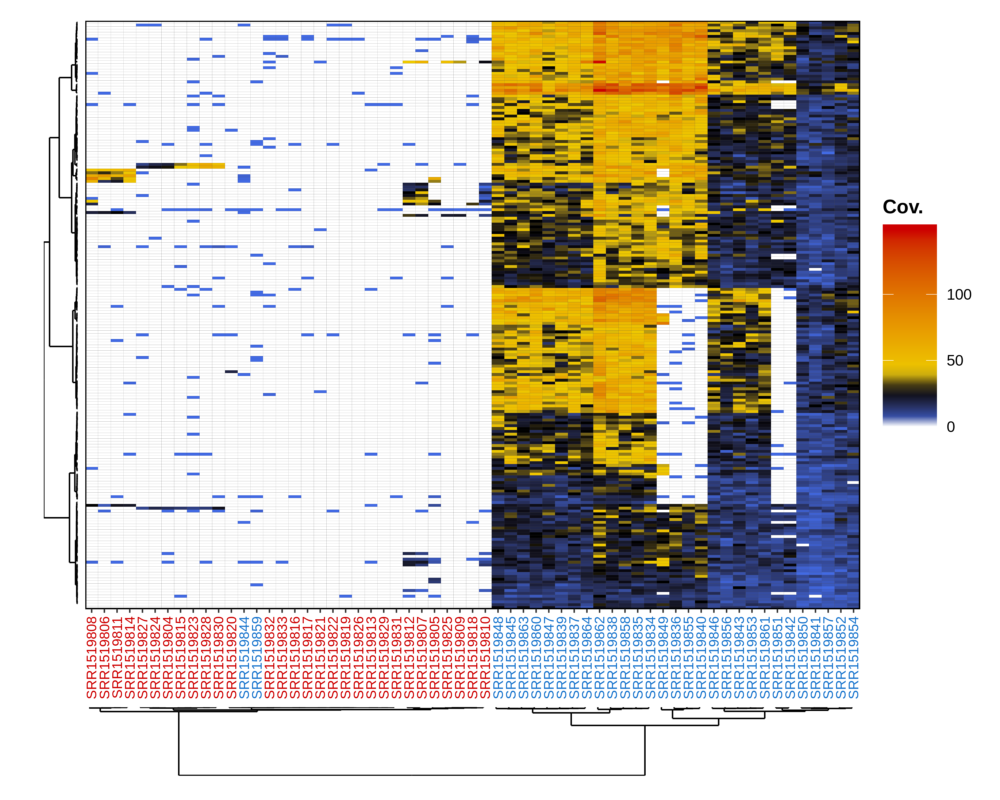

Example walkthrough
===================

In this example, we will run RADSex on a public *Oryzias latipes* RAD-Sequencing dataset. We will detail each step of the process, highlight important details, and show how to use the R package ``radsex-vis`` to generate plots from the output of ``radsex``. This guide assumes that ``radsex`` and the ``radsex-vis`` package have already been installed. For specific instruction about installing ``radsex`` and ``radsex-vis``, check the :ref:`install-release` section. All reported times and resources usage were measured on a desktop computer with an Intel i7-8700K 4.7 GHz processor, 32 Gb of memory, and a standard 7200 RPM Hard Disk Drive. Input data, results (with the exception of the markers depth table), and figures are provided in the *example* directory.

Preparing the data
------------------

The RAD-Sequencing datasets used* in this example are available on the Sequence Read Archive from NCBI. Reads were demultiplexed before being deposited on NCBI, and samples were grouped in two projects, males and females. The accession number for **female** samples is **SRS662264**, and the accession number for **male** samples is **SRS662265**. For convenience, simple scripts to download male and female samples from the EBI ftp can be found `here <https://github.com/RomainFeron/RadSex/tree/master/example/oryzias_latipes/data/download_female_samples.sh>`__ for female samples and `here <https://github.com/RomainFeron/RadSex/tree/master/example/oryzias_latipes/data/download_male_samples.sh>`__ for male samples. This dataset was published in `Wilson et al 2014 <http://www.genetics.org/content/early/2014/09/18/genetics.114.169284>`__.

A population map specifying the sex of each sample is provided `here <https://github.com/RomainFeron/RadSex/tree/master/example/oryzias_latipes/data/population_map.tsv>`_. The assembly used to align markers with `radsex map` was that of a HSOK strain, NCBI accession number **GCA_002234695.1** (`link <https://www.ncbi.nlm.nih.gov/assembly/GCA_002234695.1>`__). The chromosomes names file used to display chromosomes in genome plots is provided `here <https://github.com/RomainFeron/RadSex/tree/master/example/oryzias_latipes/data/chromosomes_names.tsv>`__.

.. note:: RADSex uses file names to generate individual IDs. Therefore, individual names in the population map must correspond to the file names without their extensions (*e.g.* the ID of an individual whose reads are in **individual_1.fq.gz** will be **individual_1**). Check the file names and population map provided above for an example of how to build the population map from file names. More details about the population map can be found in the :ref:`population-map` section.

From now on, we will assume the following directory structure:

::

    .
    ├─── samples
    |     ├────── xxx.fastq.gz
    |     ├────── xxx.fastq.gz
    |     ├────── ...
    |     └────── xxx.fastq.gz
    ├─── chromosomes_names.tsv
    ├─── genome.fasta
    └─── popmap.tsv

Generating a table of marker depths for the entire dataset
----------------------------------------------------------

The first step of RADSex is to create a table containing the depth of each marker in each individual for the entire dataset; a RADSex marker represents a non-polymorphic sequence (no mismatches or SNPs). This step is performed with the ``process`` command :

::

    radsex process --input-dir samples --output-file markers_table.tsv --threads 8

**Parameters** (see the :ref:`process-usage` usage section for details):

- ``--input-dir``: location of the demultiplexed reads directory. Supported reads file formats are described in the :ref:`reads-file`.
- ``--output-file``: path to the markers depth table generated by this command.
- ``--threads``: number of threads to use to process input files in parallel.

The output file *markers_table.tsv* will be used as input for all analyses implemented in ``radsex``, but it is not used for any ``radsex-vis`` plots. For more information about this file, check the :ref:`markers-depths-table-file` section.

.. note:: The parameter --min-depth specifies the minimum depth in at least one individual to retain a marker in the markers depth table. In most cases, we advise to keep the value of ``--min-depth`` to the default value **1** in order to retain all the information present in the dataset; this way, the markers depth table is only computed once, which is prefered as this step is by far the most computationally intensive in RADSex and markers can be filtered based on minimum depth in all downstream analyses. If you are certain that all individuals in your dataset were sequenced with high coverage and you do not plan to run analyses with a minimum depth of 1, you can specify a higher value for ``--min-depth``.

With our setup, using 8 threads, this step completed in **9 min 25 seconds** with a peak memory usage of **10.3 GB**. The resulting markers depth table used 5.1 GB of disk space.

Computing the distribution of markers between sexes
---------------------------------------------------

The ``distrib`` command computes a table summarizing the distribution of all markers between males and females:

::

    radsex distrib --markers-table markers_table.tsv --output-file distribution.tsv --popmap-file popmap.tsv --min-depth 5``

**Parameters** (see the :ref:`distrib-usage` usage section for details):

- ``--markers-table``: path to the markers depth table generated in the previous step.
- ``--output-file``: path to the distribution of markers between males and females generated by this command.
- ``--popmap-file``: path to the :ref:`population-map`.
- ``--min-depth``: minimum depth to consider a marker present in an individual.

With our setup, this step completed in **36 seconds** with a peak memory usage of **4 Mb**.

The output file *distribution.tsv* is a tabulated file described in the :ref:`sex-distribution-file` section. The distribution can be visualized with ``radsex-vis`` using the ``plot_sex_distribution`` function:

::

    radsexvis::plot_sex_distribution("distribution.tsv", output_file_path = "distribution.png")

To generate a basic plot, the only required parameter is the full path to a distribution table (**"distribution.tsv"** in this example). The figure can be directly saved to a file using the parameter ``output_file_path``; if this parameter is not specified, the plot will be generated in the current R graphic device. For a full description of the ``plot_sex_distribution()`` function, including additional parameters, check the TODO_RADSEXVIS_SECTION.

The figure obtained with the previous command is displayed below:

.. image:: ../../example/figures/distribution.png

This figure is a tile plot with number of males on the x-axis and number of females on the y-axis. The color of a tile at coordinates (**x**, **y**) indicates the number of markers that were present in any **x** males and any **y** females. For instance, in this figure, there were between 25 and 99 markers found in 29 males (not necessarily always the same 29 males) and in 0 females. Tiles for which association with sex is significant (chi-squared test, using Bonferroni correction) are highlighted in red. Many markers found predominantly in males are significantly associated with sex, indicating that an XX/XY system determines sex in this species. Interestingly, there are no markers found in more than 29 out if 31 males and absent from all females, *i.e* no markers found at position (30, 0) and (31, 0). This suggests there may be male outliers in the dataset.

With our setup, this step completed in **36 seconds** with a peak memory usage of **4 MB**.

Finding markers significantly associated with sex
-------------------------------------------------

The ``signif`` command extracts all markers significantly associated sex from the dataset:

::

    radsex signif --markers-table markers_table.tsv --output-file significant_markers.tsv --popmap-file popmap.tsv --min-depth 5

**Parameters** (see the :ref:`signif-usage` usage section for details):

- ``--markers-table``: path to the markers depth table generated with ``process``.
- ``--output-file``: path to the markers depth table generated by this command. Markers can also be exported to a fasta file with the parameter ``--output-fasta`` (see the :ref:`fasta-file` section).
- ``--popmap-file``: path to the :ref:`population-map`.
- ``--min-depth``: minimum depth to consider a marker present in an individual.

.. note:: The probability of association with sex is obtained with a chi-squared test on the number of females and males in which a marker is present. A marker is considered significantly associated with sex if its probability of association with sex is lower than 0.05 (this threshold can be adjusted with --signif-threshold) after Bonferroni correction. Markers significantly associated with sex are the ones in the tiles highlighted in red in the previous figure.

The markers depth table generated by ``signif`` can be visualized with ``radsex-vis`` using the ``plot_depth()`` function :

::

    radsexvis::plot_coverage("significant_markers.tsv", output_file_path = "significant_markers.png", popmap_file_path = "popmap.tsv")

To generate a basic plot, the only required parameter is the full path to the subset of markers depth table (**"significant_markers.tsv"** in this example). The figure can be directly saved to a file using the parameter ``output_file_path``; if this parameter is not specified, the plot will be generated in the current R graphic device. The parameter ``popmap_file_path`` can be specified to color individual IDs by sex. For a full description of the ``plot_depth()`` function, including additional parameters, check the TODO_RADSEXVIS_SECTION.

The resulting figure is displayed below:

This figure is a heatmap with individuals on the x-axis and markers on the y-axis. The color of a tile at coordinates (**x**, **y**) indicates the depth of marker **y** in individual **x**. Both individuals and markers are clustered based on depth and clustering dendrograms are displayed by default. If a popmap is specified, male and female IDs are displayed with different colors.* In this example, two males are clustered with the females, confirming the results from ``distrib`` where male-specific markers were always missing from two males. These two males are actually genetic females whose sex was mis-assigned.

With our setup, this step completed in **37 seconds** with a peak memory usage of **6 MB**.

Aligning markers to a genome
----------------------------

When a reference genome is available, markers can be aligned to it in order to locate sex-differentiated regions. This is done using the ``map`` command:

::

    radsex map --markers-file markers_table.tsv --output-file map_results.tsv --popmap-file popmap.tsv --genome-file genome.fasta --min-depth 5

**Parameters** (see the :ref:`map-usage` usage section for details):

- ``--markers-file``: path to a markers depth table generated with ``process``, ``distrib``, or ``subset``.
- ``--output-file``: path to the alignment results table generated by this command.
- ``--popmap-file``: path to the :ref:`population-map`.
- ``--genome-file``: path to the genome file.
- ``--min-depth``: minimum depth to consider a marker present in an individual.

The output file *map_results.tsv* is a tabulated file described in the :ref:`mapping-results-file` section. This file can be visualized with ``radsex-vis`` using the ``plot_genome()`` function:

::

    radsexvis::plot_genome("map_results.tsv", chromosomes_names_file_path = "chromosomes_names.tsv", output_file_path = "mapping_genome.png")

To generate a basic plot, the only required parameters is the full path to the alignment results table (**"mapping_results.tsv"** in this example). The figure can be directly saved to a file using the parameter ``output_file_path``; if this parameter is not specified, the plot will be generated in the current R graphic device. The parameter ``chromosomes_names_file_path`` can be used to specify chromosomes names as described in the :ref:`chromosomes-names` section. For a full description of the ``plot_genome()`` function, including additional parameters, check the TODO_RADSEXVIS_SECTION.

The resulting figure is displayed below:

.. image:: ../../example/figures/mapping_genome.png

This figure is a circular plot in which each sector corresponds to a chromosome and all unplaced scaffolds are grouped in an additional sector (not visible in this example as there are no unplaced scaffolds in this assembly). The top track gives the bias of a marker, 1 if the marker is present in all males and no females, and -1 if the marker is present in all females and no males. The bottom track shows the probability of association with sex (chi-squared test with Bonferroni correction).

Results for a specific region can be visualized with ``radsex-vis`` using the ``plot_contig()`` function:

::

    radsexvis::plot_contig("mapping_results.tsv", "genome.fasta.lengths", "Chr01", chromosomes_names_file_path = "chromosomes_names.tsv", output_file_path = "mapping_contig.png")

This function uses the same parameters as ``plot_genome()`` with the addition of the contig to plot (*Chr01* here). For a full description of the ``plot_contig()`` function, including additional parameters, check the TODO_RADSEXVIS_SECTION.

The resulting figure is displayed below:

.. image:: ../../example/figures/mapping_contig.png

In this figure, bias and probability of association with sex defined just above are plotted against position on the plotted contig.

With our setup, this step completed in **9 min 36 seconds** with a peak memory usage of **1.3 GB**, most of the time being spent indexing the genome. If the genome is already indexed with BWA, this step completes in **55 seconds**.

Going further
-------------

In this example, we showed the most commonly used functions of ``radsex`` and ``radsex-vis``, mostly using default parameters. In general, it is recommended to run ``distrib`` for several ``min-depth`` values (for instance 1, 2, 5, and 10) to better understand the distribution of marker depths in the dataset and estimate the robustness of markers significantly associated with sex. Three other commands are implemented in ``radsex``:

- ``subset``: extract a subset of markers based on presence in number of males and females (see the :ref:`subset-usage` usage section)
- ``freq``: compute the distribution of presence of markers in all individuals from the dataset (see the :ref:`freq-usage` usage section)
- ``depth``: compute the minimum, maximum, median, and average marker depth for each individual from the dataset (see the :ref:`depth-usage` usage section)

To get the full usage information for any ``radsex`` command, check the :ref:`full-usage` section.
